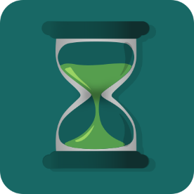

# TimePlanner

TimePlanner 

Hjälper användaren att planera sin dag eller specifika händelser i detalj. 
För en som har dålig uppfattning om tiden, om man är tex en tidsoptimist, hjälper appen 
en att hålla sig till schemat så man i slutändan är i tid samt är klar i tid.

